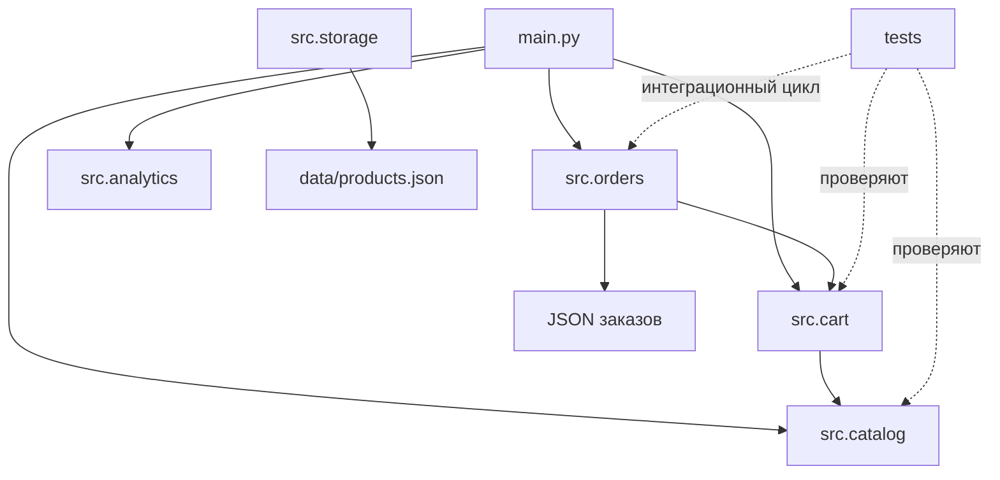

# Итоговая презентация проекта

**Продолжительность выступления:** около 5 минут 45 секунд.  
**Перед защитой:** укажите имя автора и группу на титульном слайде.

## Слайд 1. Титульный — 30 секунд

**СпортТовары — система управления магазином**  
Автор: укажите имя  
Группа: укажите группу  
Практический проект по Python

**Речь:** «Здравствуйте. Представляю проект “СпортТовары” — небольшое консольное приложение для работы с каталогом, корзиной и заказами. Цель работы — собрать отдельные модули в цельное приложение и подготовить понятную документацию».

## Слайд 2. Цель и задачи — 45 секунд

- Организовать каталог товаров и поиск.
- Добавлять, изменять и удалять позиции корзины.
- Создавать и сохранять заказы в JSON.
- Рассчитывать выручку, средний чек и популярный товар.
- Проверить взаимодействие компонентов тестами и сборкой.

**Речь:** «Работа охватывает полный путь от загрузки каталога до сохранения заказа. Отдельная задача — проверять не только функции по отдельности, но и их совместный сценарий».

## Слайд 3. Архитектура — 60 секунд

**Речь:** «Точка входа main связывает модули. Каталог отвечает за товары и поиск, корзина использует остатки каталога, заказы получают сумму корзины, а аналитика обрабатывает сохранённые заказы. Хранилище изолирует чтение и запись JSON. Такое разделение помогает менять один компонент, не смешивая его с остальными».

## Слайд 4. Основные функции — 60 секунд

- Каталог: низкий остаток, комбинированный поиск, категории и средняя цена.
- Корзина: проверка размера и остатка, изменение количества и подсчёт суммы.
- Заказы: создание, печать, сохранение и загрузка JSON.
- Аналитика: выручка, средний чек и самый продаваемый товар.

**Речь:** «Например, добавление товара проверяет размер и доступный остаток. Заказ создаётся только для непустой корзины с товарами из каталога. Аналитика использует данные заказа и считает количество проданных единиц, а не только число строк».

## Слайд 5. Демонстрация — 60 секунд

1. Запустить `python main.py`.
2. Посмотреть число товаров и позицию с низким остатком.
3. Увидеть результат поиска «кроссовки».
4. Проверить добавление двух пар в корзину и итог заказа `9000.00`.
5. При необходимости сохранить заказ через `save_orders` и загрузить `load_orders`.

**Ожидаемый результат:** приложение успешно загружает три записи каталога и формирует демонстрационный заказ.

**Речь:** «Сейчас запускаю приложение. Оно читает каталог из файла, находит кроссовки, добавляет две пары размера 40 и выводит сумму заказа. Эти шаги можно повторить напрямую через функции модулей, а операции сохранения и загрузки заказа работают с JSON».

## Слайд 6. Результаты тестирования — 45 секунд

- 14 модульных и интеграционных тестов — успешно.
- Интеграционный тест проходит цикл «каталог → корзина → заказ → JSON → загрузка».
- `python build.py` проверяет среду, запускает тесты и демонстрационное приложение.
- Итог сборки: `Сборка успешна!`.

**Речь:** «Набор содержит четырнадцать тестов. Помимо функций по отдельности, он проверяет полный цикл заказа. Сборочный скрипт сначала проверяет окружение и данные, затем тесты; приложение запускается только после успешных проверок».

## Слайд 7. Выводы и планы — 45 секунд

- Проект разделён на небольшие модули с понятными зонами ответственности.
- Данные проходят через проверяемые точки интеграции.
- Документация включает API, руководство пользователя и разработчика.
- Дальше можно добавить интерфейс, базу SQLite и больше проверок ошибок.

**Речь:** «В результате получено работающее приложение с модульной структурой, JSON-хранилищем, тестами и документацией. Следующим шагом может стать постоянная база SQLite и пользовательский интерфейс. Спасибо, готов ответить на вопросы».
